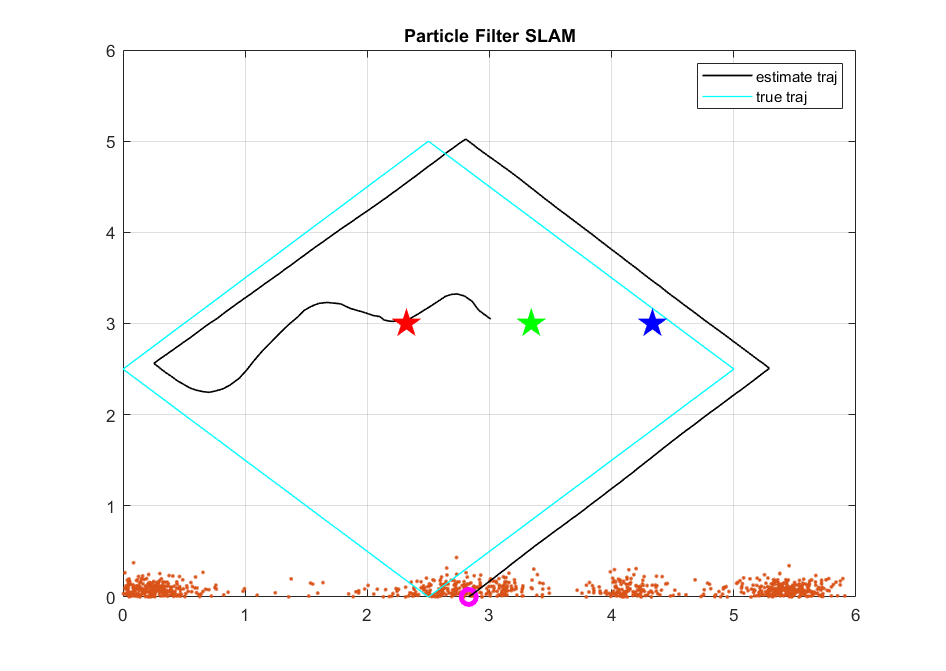
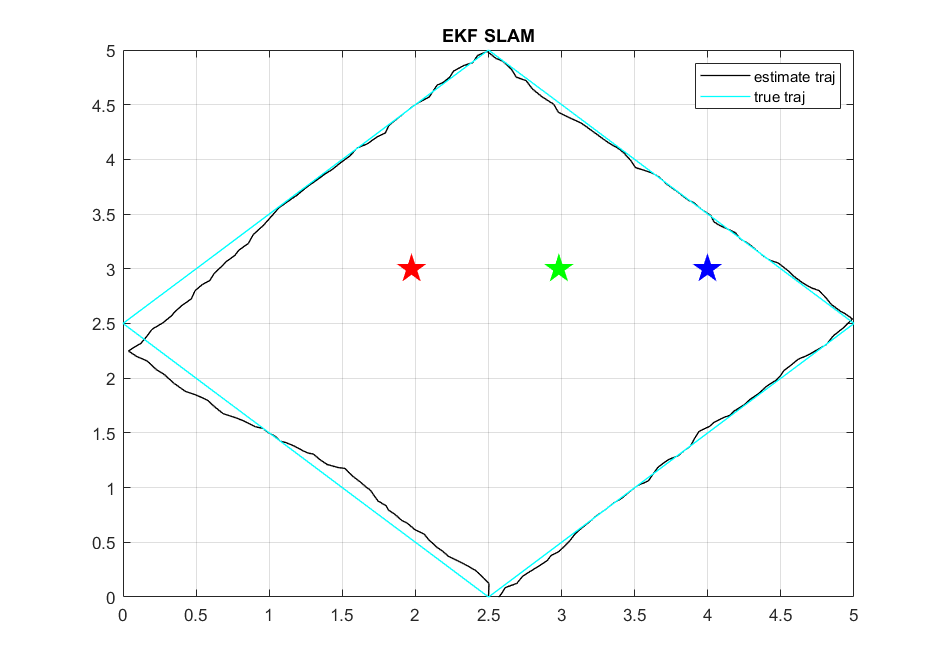

# RGB Light Landmark-Based SLAM
MEEN 689 Term Project

# About
A matlab version of landmark-based Fast SLAM using RGB light intensities as landmarks.

# How To Run
**\[Run a simulation\]:**  
```Matlab
load('Input\test_input.mat');  
PF = RunSLAM(Ut, Zt, 1500, lmY, 1); % Run Particle Filter SLAM
[ekf traj] = RunEkfSLAM(Ut, Zt, 1); % Run EKF SLAM
```

**\[Run a real data\]:** 
```Matlab
load('Input\test_data0421.mat');
[ekf traj] = RunEkfSLAM(U, rgb_d, 0);
```

# Detail
Run RunSLAM.m function (input the motion data and measurement data) to run the whole project.

Particle.m:
  a class of a single particle.
  
ParticleFilterSLAM.m:
  a class of the SLAM algorithm, including methods like predictParticles(), updateParticles(), resampling() ... etc.


# Simulation
Run Particle Filter SLAM with
  number of particles: 2000  
  process noise variacne: 0.03  
  measurement noise variance: 1  
    
  
Run EKF SLAM with  
  process noise variacne: 0.03  
  measurement noise variance: 1  
    
  

  
